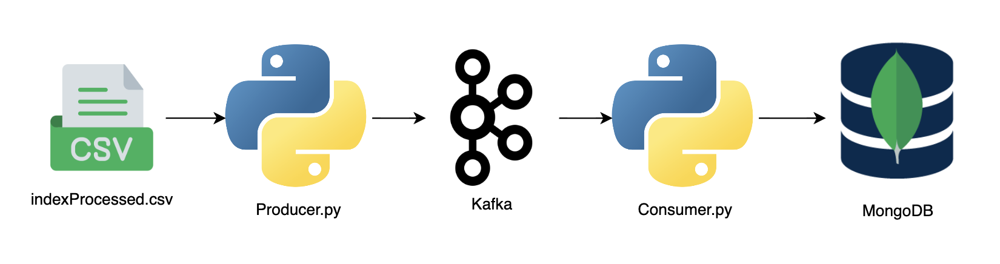

# Data Ingestion with Kafka

This project demonstrates the use of Apache `Kafka` for data ingestion. The pipeline includes producing messages to a
Kafka `topic` from a `CSV` file and consuming these messages to store them in a `MongoDB` database.

# Data Flow


### Install the dependencies using pip:

```bash
pip install kafka-python pandas pymongo
```

# [KafkaProducer](kafka-producer.ipynb)

The producer reads a random record from a CSV file (indexProcessed.csv) and sends it as a JSON message to a Kafka
topic (demo_test).

- Connects to Kafka on `localhost:9092`.
- Reads data from `indexProcessed.csv`.
- Sends random records to the `Kafka topic`, one by one, in a loop.

# [KafkaConsumer](kafka-consumer.ipynb)

## Purpose

The consumer listens to the Kafka topic (`demo_test`) and inserts incoming JSON messages into a MongoDB collection (customers).

- Connects to Kafka on `localhost:9092`.
- Connects to MongoDB on `mongodb://localhost:27017/`.
- Consumes messages from the `Kafka topic` and inserts them into the `MongoDB` collection.


## WorkFlow
- Start the `Kafka` and `Zookeeper` services.
- Create the `demo_test` topic in Kafka.
- Run the producer script to `send` messages to the demo_test topic.
- Run the consumer script to `consume` messages and store them into `MongoDB`.

